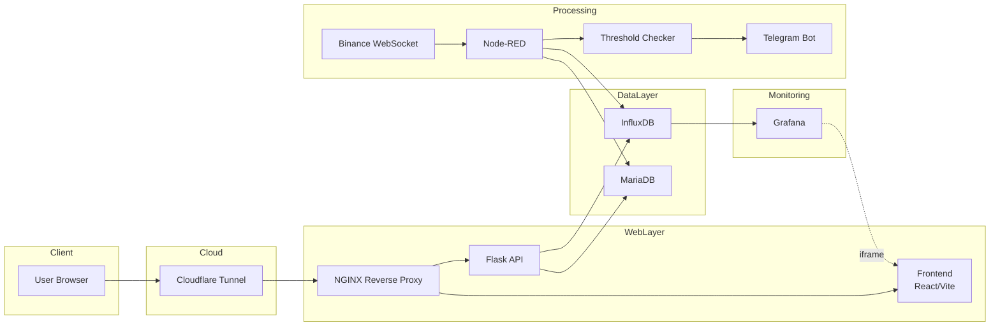
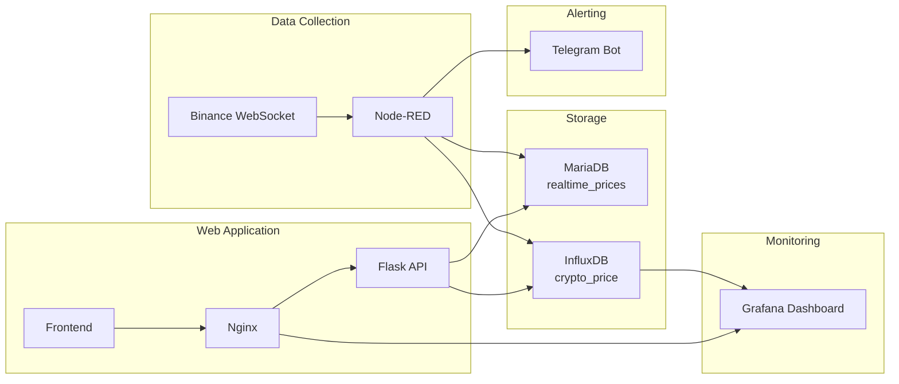
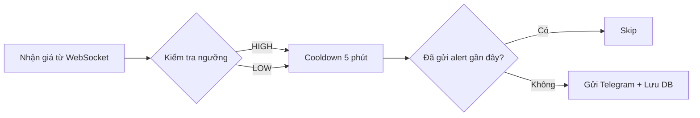

<div align="center">

# 🚀 CRYPTO MONITOR & ALERT SYSTEM

> **Hệ thống giám sát giá tiền điện tử realtime với cảnh báo tự động qua Telegram**  
> Theo dõi BTC · ETH · SOL · Cảnh báo bất thường · Telegram · Dashboard Grafana · Docker

[](https://docs.docker.com)
[](https://nodered.org)
[](https://grafana.com)
[](https://influxdata.com)
[](https://flask.palletsprojects.com)
[](https://www.phpmyadmin.net)

</div>

---

# 📌 MỤC LỤC

1. [Lý thuyết Docker](#1-lý-thuyết-docker)
   - [Docker là gì?](#11-docker-là-gì)
   - [Các keyword trong docker-compose.yml](#12-các-keyword-trong-docker-composeyml)
   - [Ưu điểm khi triển khai app bằng Docker](#13-ưu-điểm-khi-triển-khai-app-bằng-docker)
   - [Triển khai lên máy chủ không có Internet](#14-triển-khai-lên-máy-chủ-không-có-internet)
2. [Tổng quan hệ thống](#2-tổng-quan-hệ-thống)
3. [Kiến trúc hệ thống](#3-kiến-trúc-hệ-thống)
4. [Yêu cầu hệ thống](#4-yêu-cầu-hệ-thống)
5. [Cấu trúc thư mục](#5-cấu-trúc-thư-mục)
6. [Cấu hình chi tiết từng service](#6-cấu-hình-chi-tiết-từng-service)
7. [Các bước cài đặt & chạy](#7-các-bước-cài-đặt--chạy)
8. [Cấu hình Node-RED](#8-cấu-hình-node-red)
9. [Cấu hình Grafana](#9-cấu-hình-grafana)
10. [Cấu hình Telegram Alert Bot](#10-cấu-hình-telegram-alert-bot)
11. [Logic cảnh báo bất thường](#11-logic-cảnh-báo-bất-thường)
12. [Triển khai offline lên máy chủ thật](#12-triển-khai-offline-lên-máy-chủ-thật)
13. [Troubleshooting](#13-troubleshooting)

---

# 1. Lý thuyết Docker

## 1.1 Docker là gì?

Docker là nền tảng **containerization** mã nguồn mở cho phép đóng gói ứng dụng cùng toàn bộ dependencies vào một đơn vị tiêu chuẩn gọi là **container**, đảm bảo ứng dụng chạy đồng nhất trên mọi môi trường.

### 🔷 Các khái niệm cốt lõi

| Khái niệm | Định nghĩa |
|---|---|
| **Container** | Tiến trình cô lập chạy từ Image, có filesystem, network, process riêng; nhẹ hơn VM nhiều lần |
| **Image** | Template read-only (snapshot) để tạo Container; được build từ Dockerfile theo từng layer |
| **Docker Engine** | Daemon chạy nền (`dockerd`) quản lý Container, Image, Network, Volume |
| **Docker Hub** | Registry công khai tại hub.docker.com để lưu trữ và chia sẻ Image |
| **Docker Compose** | Công cụ định nghĩa & chạy multi-container bằng file `docker-compose.yml` |

---

## 1.2 Các keyword trong docker-compose.yml

| Keyword | Ý nghĩa | Cú pháp | Ví dụ |
|---|---|---|---|
| `services` | Khai báo danh sách các service (container) | `services:` là root key | `services:` `  web:` `  db:` |
| `image` | Chỉ định Image có sẵn để chạy | `image: <name>:<tag>` | `image: nginx:1.25-alpine` |
| `build` | Build Image từ Dockerfile | `build: ./path` hoặc `context/dockerfile` | `build: context: ./app` `dockerfile: Dockerfile` |
| `container_name` | Đặt tên cố định cho container | `container_name: <tên>` | `container_name: crypto_nginx` |
| `ports` | Map port host:container (publish ra ngoài) | `- "host:container"` | `- "80:80"` `- "3000:3000"` |
| `expose` | Mở port nội bộ giữa các service (không ra ngoài) | `- "port"` | `- "5000"` |
| `environment` | Biến môi trường inline | `- KEY=value` | `- MYSQL_ROOT_PASSWORD=secret` |
| `env_file` | Load biến môi trường từ file `.env` | `env_file: - .env` | `env_file: - .env` |
| `volumes` | Mount dữ liệu (bind mount hoặc named volume) | `- source:target` | `- ./data:/var/lib/mysql` |
| **bind mount** | Mount thư mục host vào container | `- ./local/path:/container/path` | `- ./nginx:/etc/nginx:ro` |
| **named volume** | Volume được Docker quản lý, persist qua restart | Khai báo ở `volumes:` root | `mariadb_data:/var/lib/mysql` |
| `restart` | Chính sách khởi động lại container | `no` / `always` / `unless-stopped` / `on-failure` | `restart: unless-stopped` |
| `depends_on` | Thứ tự khởi động + điều kiện health | `depends_on:` `  service: condition:` | `depends_on: db: condition: service_healthy` |
| `networks` | Gán service vào network | `networks: - <network_name>` | `networks: - crypto_net` |
| `healthcheck` | Kiểm tra trạng thái container | `test/interval/timeout/retries` | `test: ["CMD","curl","-f","http://localhost/health"]` |
| `command` | Ghi đè CMD mặc định của Image | `command: <lệnh>` | `command: gunicorn app:app` |
| `entrypoint` | Ghi đè ENTRYPOINT của Image | `entrypoint: <lệnh>` | `entrypoint: /docker-entrypoint.sh` |
| `hostname` | Đặt hostname cho container | `hostname: <tên>` | `hostname: crypto-api` |
| `secrets` | Mount secret an toàn vào container | `secrets: - db_password` | Khai báo ở `secrets:` root |
| `configs` | Mount config file vào container | `configs: - app_config` | Khai báo ở `configs:` root |

> **Ví dụ tổng hợp:**
```yaml
services:
  web:
    image: nginx:alpine
    container_name: my_nginx
    build:
      context: ./nginx
    ports:
      - "80:80"
    expose:
      - "8080"
    environment:
      - ENV=production
    env_file:
      - .env
    volumes:
      - ./html:/usr/share/nginx/html:ro   # bind mount
      - nginx_logs:/var/log/nginx          # named volume
    restart: unless-stopped
    depends_on:
      api:
        condition: service_healthy
    networks:
      - app_net
    healthcheck:
      test: ["CMD", "nginx", "-t"]
      interval: 30s
      timeout: 10s
      retries: 3
    hostname: web-server
```

---

## 1.3 Ưu điểm khi triển khai app bằng Docker

### ✅ Portable (Di chuyển được)
```
Developer A (Windows)  ──┐
Developer B (macOS)    ──┼──▶ docker-compose up ──▶ Chạy giống nhau 100%
Production (Ubuntu)    ──┘
```
> Không còn vấn đề "works on my machine". Toàn bộ môi trường được đóng gói trong Image.

### ✅ Isolation (Cô lập)
Mỗi container có filesystem, network, process riêng. Flask API và MariaDB không can thiệp nhau. Nâng cấp MariaDB 10.11 → 11.0 không ảnh hưởng container khác.

#### ✅ Scalability (Mở rộng)
```bash
# Scale Flask API lên 3 instances
docker compose up --scale flask-api=3
```
Kết hợp với Nginx load balancer, hệ thống xử lý nhiều request hơn mà không cần thay đổi code.

#### ✅ Reproducibility (Tái tạo)
```bash
# Build lại từ đầu, luôn ra kết quả giống nhau
docker compose build --no-cache
```
CI/CD pipeline, staging, production đều dùng cùng một Image → loại bỏ sai lệch môi trường.

### ✅ CI/CD Integration
```yaml
# .github/workflows/deploy.yml
- name: Build & Push
  run: docker build -t myapp:${{ github.sha }} .
- name: Deploy
  run: docker compose up -d --pull always
```

### ✅ Resource Efficiency (Hiệu quả tài nguyên)
Container chia sẻ kernel với host OS, khởi động trong milli-giây, tiêu thụ RAM ít hơn VM 10–20x.

---

## 1.4 Triển khai lên máy chủ không có Internet

### 📦 BƯỚC 1: Trên máy phát triển (có Internet)

```bash
# 1. Build toàn bộ images
docker compose build

# 2. Pull các image từ Docker Hub (chưa có local)
docker pull nginx:1.25-alpine
docker pull mariadb:10.11
docker pull influxdb:2.7
docker pull grafana/grafana:10.4.0
docker pull nodered/node-red:3.1.9
docker pull cloudflare/cloudflared:latest

# 3. Xem danh sách images cần export
docker images | grep -E "crypto|nginx|mariadb|influxdb|grafana|nodered|cloudflared"

# 4. Lưu (save) tất cả images thành file .tar
docker save \
  crypto-monitor-flask-api \
  crypto-monitor-frontend \
  nginx:1.25-alpine \
  mariadb:10.11 \
  influxdb:2.7 \
  grafana/grafana:10.4.0 \
  nodered/node-red:3.1.9 \
  cloudflare/cloudflared:latest \
  -o crypto-monitor-images.tar

# 5. Nén file tar để giảm kích thước
gzip -9 crypto-monitor-images.tar
# → tạo ra: crypto-monitor-images.tar.gz

# Kiểm tra kích thước
ls -lh crypto-monitor-images.tar.gz
```

### 🔌 BƯỚC 2: Chuyển sang server offline

```bash
# Cách 1: USB / ổ cứng ngoài
cp crypto-monitor-images.tar.gz /media/usb/
# Cắm USB vào server và copy vào server

# Cách 2: SCP qua mạng nội bộ (LAN)
scp crypto-monitor-images.tar.gz user@192.168.1.100:/home/user/

# Cách 3: Rsync (an toàn hơn, resume được)
rsync -avzP crypto-monitor-images.tar.gz user@192.168.1.100:/opt/crypto-monitor/

# Cùng copy toàn bộ project (không có node_modules)
rsync -avz --exclude='node_modules' --exclude='.git' \
  ./crypto-monitor/ user@192.168.1.100:/opt/crypto-monitor/
```

### 🖥️ BƯỚC 3: Trên server offline

```bash
# SSH vào server
ssh user@192.168.1.100
cd /opt/crypto-monitor

# Giải nén
gunzip crypto-monitor-images.tar.gz

# Load tất cả images vào Docker
docker load -i crypto-monitor-images.tar

# Kiểm tra images đã load
docker images

# Chỉnh sửa .env cho môi trường server
cp .env.example .env
nano .env

# Chạy hệ thống (không cần pull từ internet)
docker compose up -d

# Xem trạng thái
docker compose ps
docker compose logs -f
```

### 💾 BƯỚC 4: Backup Volume

```bash
# Backup MariaDB volume
docker run --rm \
  -v crypto-monitor_mariadb_data:/data \
  -v $(pwd)/backups:/backup \
  alpine tar czf /backup/mariadb_$(date +%Y%m%d_%H%M%S).tar.gz -C /data .

# Backup InfluxDB volume
docker run --rm \
  -v crypto-monitor_influxdb_data:/data \
  -v $(pwd)/backups:/backup \
  alpine tar czf /backup/influxdb_$(date +%Y%m%d_%H%M%S).tar.gz -C /data .

# Backup Grafana volume
docker run --rm \
  -v crypto-monitor_grafana_data:/data \
  -v $(pwd)/backups:/backup \
  alpine tar czf /backup/grafana_$(date +%Y%m%d_%H%M%S).tar.gz -C /data .

# Backup Node-RED volume
docker run --rm \
  -v crypto-monitor_nodered_data:/data \
  -v $(pwd)/backups:/backup \
  alpine tar czf /backup/nodered_$(date +%Y%m%d_%H%M%S).tar.gz -C /data .

echo "✅ Backup hoàn tất tại ./backups/"
ls -lh backups/
```

### 🔄 BƯỚC 5: Restore Volume

```bash
# Stop stack trước khi restore
docker compose down

# Restore MariaDB (thay tên file backup thực tế)
docker run --rm \
  -v crypto-monitor_mariadb_data:/data \
  -v $(pwd)/backups:/backup \
  alpine sh -c "cd /data && tar xzf /backup/mariadb_20260601_120000.tar.gz"

# Restore InfluxDB
docker run --rm \
  -v crypto-monitor_influxdb_data:/data \
  -v $(pwd)/backups:/backup \
  alpine sh -c "cd /data && tar xzf /backup/influxdb_20260601_120000.tar.gz"

# Restore Grafana
docker run --rm \
  -v crypto-monitor_grafana_data:/data \
  -v $(pwd)/backups:/backup \
  alpine sh -c "cd /data && tar xzf /backup/grafana_20260601_120000.tar.gz"

# Khởi động lại
docker compose up -d
echo "✅ Restore hoàn tất!"
```

### 📤 Export & Import Container (snapshot runtime)

```bash
# Export container đang chạy thành .tar
docker export crypto_flask_api -o flask_api_snapshot.tar

# Import lại thành Image mới
docker import flask_api_snapshot.tar crypto-flask-api:snapshot

# Chạy từ image đã import
docker run -d --name flask_restored crypto-flask-api:snapshot
```

---

# 2. Tổng quan hệ thống

**Crypto Monitor & Alert System** là hệ thống giám sát giá tiền điện tử **realtime** hoàn chỉnh, được triển khai hoàn toàn bằng Docker Compose.

## ✨ Tính năng chính

| Tính năng | Mô tả |
|---|---|
| 📡 **Realtime Data** | Kết nối Binance WebSocket, nhận giá BTC/ETH/SOL mỗi giây |
| 💾 **Dual Storage** | MariaDB lưu giá hiện tại, InfluxDB lưu lịch sử time-series |
| 📊 **Dashboard** | Grafana hiển thị biểu đồ giá lịch sử, embed vào frontend |
| 🔴 **Auto Alert** | Phát hiện bất thường, gửi cảnh báo Telegram tức thì |
| 🌐 **Web UI** | Frontend React dark-theme phong cách TradingView |
| 🔌 **REST API** | Flask API cung cấp endpoints cho frontend |
| ☁️ **Public URL** | Cloudflare Tunnel expose ra internet không cần public IP |

---

# 3. Kiến trúc hệ thống



## 🌐 Luồng dữ liệu



---

# 4. Yêu cầu hệ thống

## 💻 Máy phát triển

| Yêu cầu | Tối thiểu | Khuyến nghị |
|---|---|---|
| OS | Ubuntu 20.04 / Windows 10 WSL2 / macOS 12 | Ubuntu 22.04 LTS |
| CPU | 2 cores | 4 cores |
| RAM | 4 GB | 8 GB |
| Disk | 10 GB | 20 GB |
| Docker | 24.x | 26.x |
| Docker Compose | 2.x | 2.27+ |

## 🌐 Kết nối mạng

- Internet để kết nối Binance WebSocket
- Port 80 và 3000 mở trên firewall
- Telegram Bot Token (tạo qua [@BotFather](https://t.me/BotFather))
- Cloudflare account (nếu dùng tunnel)

---

# 5. Cấu trúc thư mục

```
crypto-monitor-project/
│
├── 📄 docker-compose.yml          # Orchestration toàn bộ hệ thống
├── 📄 .env                        # Biến môi trường (KHÔNG commit)
├── 📄 .env.example                # Template .env
├── 📄 .gitignore
├── 📄 README.md
│
├── 📁 nginx/
│   ├── nginx.conf                 # Cấu hình Nginx chính
│   └── conf.d/
│       └── default.conf           # Virtual host, reverse proxy
│
├── 📁 frontend/                   # React + Vite application
│   ├── Dockerfile
│   ├── package.json
│   ├── vite.config.js
│   ├── index.html
│   ├── dist/                      # Build output (auto-generated)
│   └── src/
│       ├── main.jsx
│       ├── App.jsx                # Dashboard chính
│       └── index.css
│
├── 📁 flask-api/                  # Python Flask REST API
│   ├── Dockerfile
│   ├── requirements.txt
│   └── app.py
│
├── 📁 mariadb/
│   └── init/
│       └── 01_init.sql            # Schema khởi tạo
│
├── 📁 nodered/
│   ├── flows.json                 # Node-RED pipeline
│   ├── settings.js
│   └── package.json               # Extra nodes
│
├── 📁 grafana/
│   ├── dashboards/
│   │   └── crypto-prices.json     # Dashboard definition
│   └── provisioning/
│       ├── datasources/
│       │   └── datasources.yml
│       └── dashboards/
│           └── dashboards.yml
└── 📁 scripts/
    ├── backup.sh                  # Script backup volumes
    ├── restore.sh                 # Script restore volumes
    └── offline-export.sh          # Export images cho deploy offline
```

---

# 6. Cấu hình chi tiết từng service

## 🔷 Nginx

```yaml
nginx:
  image: nginx:1.25-alpine
  ports:
    - "80:80"
  volumes:
    - ./nginx/nginx.conf:/etc/nginx/nginx.conf:ro
    - ./frontend/dist:/usr/share/nginx/html:ro
```

**Nhiệm vụ:**
- Serve static files của Frontend React
- Reverse proxy `/api/*` → Flask API `:5000`
- Reverse proxy `/grafana/` → Grafana `:3000`
- Reverse proxy `/nodered/` → Node-RED `:1880`

## 🔷 Flask API

```yaml
flask-api:
  build: ./flask-api
  expose:
    - "5000"
  depends_on:
    mariadb:
      condition: service_healthy
    influxdb:
      condition: service_healthy
```

**Endpoints:**
```
GET /api/health          → Kiểm tra API còn sống
GET /api/prices          → Giá realtime tất cả coin
GET /api/prices/{symbol} → Giá một coin cụ thể
GET /api/history/{symbol}?range=1h|6h|24h|7d → Lịch sử từ InfluxDB
GET /api/alerts?limit=50 → Lịch sử cảnh báo
GET /api/system-status   → Trạng thái tất cả services
```

## 🔷 MariaDB

```yaml
mariadb:
  image: mariadb:10.11
  volumes:
    - mariadb_data:/var/lib/mysql
    - ./mariadb/init:/docker-entrypoint-initdb.d:ro
```

**Schema:**
```sql
-- Giá realtime (upsert mỗi giây)
CREATE TABLE IF NOT EXISTS `realtime_prices` (
    `id`         INT UNSIGNED NOT NULL AUTO_INCREMENT,
    `symbol`     VARCHAR(20)  NOT NULL,
    `price`      DECIMAL(20, 8) NOT NULL DEFAULT 0,
    `volume`     DECIMAL(30, 8) NOT NULL DEFAULT 0,
    `updated_at` DATETIME NOT NULL DEFAULT CURRENT_TIMESTAMP ON UPDATE CURRENT_TIMESTAMP,
    PRIMARY KEY (`id`),
    UNIQUE KEY `uq_symbol` (`symbol`),
    INDEX `idx_updated_at` (`updated_at`)
) ENGINE=InnoDB DEFAULT CHARSET=utf8mb4;

-- Lịch sử cảnh báo
CREATE TABLE `price_alerts` (
  `id` int(10) UNSIGNED NOT NULL,
  `symbol` varchar(20) NOT NULL,
  `alert_type` enum('HIGH','LOW') NOT NULL,
  `price` decimal(20,8) NOT NULL,
  `threshold` decimal(20,8) NOT NULL,
  `message` text CHARACTER SET utf8mb4 COLLATE utf8mb4_unicode_ci DEFAULT NULL,
  `sent_at` datetime NOT NULL DEFAULT current_timestamp()
) ENGINE=InnoDB DEFAULT CHARSET=utf8mb4 COLLATE=utf8mb4_general_ci;
```

## 🔷 InfluxDB

```yaml
influxdb:
  image: influxdb:2.7
  environment:
    - DOCKER_INFLUXDB_INIT_MODE=setup
    - DOCKER_INFLUXDB_INIT_BUCKET=crypto_prices
```

**Measurement:** `crypto_price`
- Tags: `symbol` (BTCUSDT / ETHUSDT / SOLUSDT)
- Fields: `price` (float), `volume` (float)
- Retention: mặc định unlimited (cấu hình trong Grafana)

## 🔷 Grafana

```yaml
grafana:
  image: grafana/grafana:10.4.0
  environment:
    - GF_AUTH_ANONYMOUS_ENABLED=true
    - GF_SECURITY_ALLOW_EMBEDDING=true
```

`GF_SECURITY_ALLOW_EMBEDDING=true` cho phép nhúng Grafana dashboard vào frontend qua `<iframe>`.

## 🔷 Node-RED

```yaml
nodered:
  image: nodered/node-red:3.1.9
  volumes:
    - nodered_data:/data
    - ./nodered/flows.json:/data/flows.json:ro
```

Extra nodes được cài tự động qua `package.json`:
- `node-red-contrib-influxdb` — Write vào InfluxDB v2
- `node-red-node-mysql` — Kết nối MariaDB

## 🔷 Cloudflared

```yaml
cloudflared:
  image: cloudflare/cloudflared:latest
  command: tunnel --no-autoupdate run --token ${CLOUDFLARE_TUNNEL_TOKEN}
```

---

# 7. Các bước cài đặt & chạy

## Bước 1: Cài Docker & Docker Compose

```bash
# Ubuntu / Debian
sudo apt update
sudo apt install -y ca-certificates curl gnupg

curl -fsSL https://download.docker.com/linux/ubuntu/gpg | \
  sudo gpg --dearmor -o /etc/apt/keyrings/docker.gpg

echo "deb [arch=$(dpkg --print-architecture) signed-by=/etc/apt/keyrings/docker.gpg] \
  https://download.docker.com/linux/ubuntu $(lsb_release -cs) stable" | \
  sudo tee /etc/apt/sources.list.d/docker.list > /dev/null

sudo apt update
sudo apt install -y docker-ce docker-ce-cli containerd.io docker-compose-plugin

# Thêm user vào group docker (không cần sudo)
sudo usermod -aG docker $USER
newgrp docker

# Kiểm tra
docker --version
docker compose version
```


## Bước 2: Clone project

```bash
git clone https://github.com/nhukhiem3143/BT5-Crypto-Monitor-Dev-App-OpenSrc.git
cd crypto-monitor-project
```

## Bước 3: Cấu hình `.env`

```bash
cp .env.example .env
nano .env
```

Điền đầy đủ các giá trị:

```env
# --- Project ---
COMPOSE_PROJECT_NAME=crypto-monitor

# --- MariaDB ---
MARIADB_ROOT_PASSWORD=
MARIADB_DATABASE=cryptodb
MARIADB_USER=
MARIADB_PASSWORD=

# --- InfluxDB ---
INFLUXDB_ADMIN_USER=
INFLUXDB_ADMIN_PASSWORD=
INFLUXDB_ORG=crypto-org
INFLUXDB_BUCKET=crypto_prices
INFLUXDB_TOKEN=N2d0xXFRGQY4xxxxxxxxxxx

# --- Grafana ---
GRAFANA_ADMIN_USER=
GRAFANA_ADMIN_PASSWORD=

# --- Telegram ---
TELEGRAM_BOT_TOKEN=xxxxx
TELEGRAM_CHAT_ID=-1003xxxxx

# --- Cloudflare ---
CLOUDFLARE_TUNNEL_TOKEN=

# --- Flask ---
FLASK_SECRET_KEY=flask-secret-key-change-in-production
FLASK_ENV=production

# --- Binance WebSocket ---
BINANCE_WS_URL=wss://stream.binance.com:9443/stream
SYMBOLS=btcusdt,ethusdt,solusdt

# --- Alert Thresholds ---
BTC_HIGH=120000
BTC_LOW=100000
ETH_HIGH=7000
ETH_LOW=4000
SOL_HIGH=300
SOL_LOW=100
```

## Bước 4: Khởi chạy hệ thống

```bash
# Build và start tất cả services
docker compose up -d --build


# Kiểm tra trạng thái
docker compose ps
```


## Bước 5: Kiểm tra

| Service | URL | 
|---|---|
| **Frontend** | http://http://192.168.100.2/ | 
| **Flask API** | http://http://192.168.100.2/api/health | 
| **Grafana** | http://192.168.100.2/:3000 |
| **Node-RED** | http://192.168.100.2:1880 | 
| **InfluxDB** | http://192.168.100.2:8086 | 
| **PhpMyadmin** | http://192.168.100.2:8086 |


---

# 8. Cấu hình Node-RED

## 8.1 Truy cập giao diện

Mở trình duyệt: **http://192.168.100.2:1880/**

## 8.2 Import flows (nếu chưa tự load)

1. Vào **☰ Menu** → **Import**
2. Paste nội dung file `nodered/flows.json`
3. Click **Import**
4. Click **Deploy** (nút đỏ góc trên phải)


## 8.3 Cấu hình credentials MariaDB

1. Double-click node **MariaDB Insert**
2. Click biểu tượng ✏️ bên cạnh Database
3. Điền:
   - **Host**: `mariadb`
   - **Port**: `3306`
   - **User**: `admin`
   - **Password**: `admin123`
   - **Database**: `cryptodb`
4. **Add** → **Done** → **Deploy**


## 8.4 Cấu hình credentials InfluxDB
### Lấy token InfluxDB
1. Mở InfluxDB UI tại http://192.168.100.2:8086.
2. Đăng nhập bằng INFLUXDB_ADMIN_USER và INFLUXDB_ADMIN_PASSWORD.
3. Vào menu Load Data → API Tokens.
4. Chọn Generate Token:
   - Nếu muốn toàn quyền → chọn All Access Token.
   - Nếu chỉ muốn ghi dữ liệu vào bucket crypto_prices → chọn Write Token cho bucket đó.
5. Copy chuỗi token vừa tạo và dán vào biến môi trường INFLUXDB_TOKEN trong file .env.


### Cấu hình trong Node-RED
1. Double-click node **InfluxDB Write**
2. Click ✏️ bên cạnh Server
3. Điền:
   - **Version**: `2.0`
   - **URL**: `http://influxdb:8086`
   - **Token**: _(giá trị INFLUXDB_TOKEN trong .env)_
   - **Organization**: `crypto-org`
   - **Bucket**: `crypto_prices`
4. **Add** → **Done** → **Deploy**


## 8.5 Kiểm tra flow hoạt động

Sau khi Deploy, mở **Debug sidebar** (biểu tượng 🐛). Bạn sẽ thấy log mỗi 10 giây:
```
BTCUSDT: $105234.50 | ETHUSDT: $4120.33 | SOLUSDT: $187.22
```


---

# 9. Cấu hình Grafana

## 9.1 Đăng nhập

- URL: **http://192.168.100.2:3000**
- User: `admin` / Password: _(GRAFANA_ADMIN_PASSWORD)_

## 9.2 Kiểm tra Datasource

1. **☰ Menu** → **Connections** → **Data sources**
2. Chọn **InfluxDB** (đã được provisioning tự động)
3. Click **Save & test** → Xanh lá ✅


## 9.3 Import Dashboard

1. **☰ Menu** → **Dashboards** → **Import**
2. Upload file `grafana/dashboards/crypto-prices.json`
3. Chọn datasource **InfluxDB** → **Import**


## 9.4 Lấy URL iframe cho Frontend

1. Mở dashboard **Crypto Monitor**
2. Nhấn **Share** (biểu tượng 🔗) trên panel BTC
3. Chọn tab **Embed**
4. Bật **Current time range**
5. Copy đường dẫn iframe

Cập nhật trong `frontend/src/App.jsx`:
```javascript
const iframeSrc = `http://localhost:3000/d/crypto-prices/crypto-monitor?orgId=1&...`
```


---

# 10. Cấu hình Telegram Alert Bot

## Bước 1: Tạo Bot mới

1. Mở Telegram, tìm **[@BotFather](https://t.me/BotFather)**
2. Gõ `/newbot`
3. Đặt tên bot: `CryptoMonitorBot`
4. Đặt username: `crypto_khiem_bot`
5. **BotFather** trả về **Token** dạng: `1234567890:ABCdefGHI...`
6. Lưu token vào `.env`:
   ```env
   TELEGRAM_BOT_TOKEN=1234567890:ABCdefGHIjklMNOpqrSTUvwxYZ
   ```


## Bước 2: Tạo Group Telegram

1. Tạo group mới: **Crypto Alert Group**
2. Thêm các thành viên: User `1875746636`
3. Thêm bot vào group (search username của bot)
4. **Bắt buộc**: Set bot làm **Admin** trong group (để gửi được tin nhắn)


## Bước 3: Lấy Chat ID của Group

```bash
# Gửi một tin nhắn bất kỳ vào group trước
# Sau đó truy vấn:
curl "https://api.telegram.org/bot<YOUR_TOKEN>/getUpdates"
```
c
Tìm trong kết quả JSON:
```json
{
  "chat": {
    "id": -100123456xxxxx,   ← Đây là Chat ID (số âm = group)
    "type": "supergroup"
  }
}
```

Lưu vào `.env`:
```env
TELEGRAM_CHAT_ID=
```


## Bước 4: Restart Node-RED

```bash
docker compose restart nodered
```
### Bot đã gửi tin nhắn thành công


---

# 11. Logic cảnh báo bất thường

## 🎯 Ngưỡng cảnh báo

| Coin | ALERT HIGH | ALERT LOW |
|---|---|---|
| **BTCUSDT** | > $120,000 | < $100,000 |
| **ETHUSDT** | > $7,000 | < $4,000 |
| **SOLUSDT** | > $300 | < $100 |

## 🔄 Flow logic trong Node-RED



**Cooldown 5 phút**: Tránh spam alert khi giá dao động quanh ngưỡng. Mỗi (symbol + direction) có cooldown độc lập.

## 📱 Format tin nhắn Telegram


---

# 12. Triển khai offline lên máy chủ thật

## 12.1 Export toàn bộ images

```bash
# Chạy script export tự động
chmod +x scripts/offline-export.sh
./scripts/offline-export.sh
```

Hoặc thủ công:

```bash
# Lưu images
docker save \
  $(docker compose config --images | tr '\n' ' ') \
  -o crypto-monitor-all-images.tar

gzip -9 crypto-monitor-all-images.tar

ls -lh crypto-monitor-all-images.tar.gz
```


## 12.2 Chuyển lên server

```bash
# SCP trực tiếp
scp -r crypto-monitor-all-images.tar.gz \
       docker-compose.yml .env \
  user@server-ip:/opt/crypto-monitor/
```

## 12.3 Deploy trên server offline

```bash
ssh user@server-ip
cd crypto-monitor-project

# Load images
gunzip crypto-monitor-all-images.tar.gz
docker load -i crypto-monitor-all-images.tar


# Chạy stack
docker compose up -d
docker compose ps
```


## 12.4 Cấu hình Cloudflare Tunnel

1. Đăng nhập [Cloudflare Zero Trust](https://one.dash.cloudflare.com/)
2. **Access** → **Tunnels** → **Create a tunnel**
3. Đặt tên: `crypto-monitor`


4. **Docker** → Copy token
5. Paste token vào `.env`:
   ```env
   CLOUDFLARE_TUNNEL_TOKEN=eyJhbGciOiJIUzI1...
   ```


6. **Public Hostname**:
   - Subdomain: `crypto`
   - Domain: `nhukhiem.id.vn`
   - Service: `http://nginx:80`


7. Restart cloudflared:
   ```bash
   docker compose restart cloudflared
   ```

Truy cập qua: **https://crypto.nhukhiem.id.vn**


---

# 13. Troubleshooting

## Container không khởi động

```bash
# Xem log chi tiết
docker compose logs flask-api
docker compose logs mariadb

# Kiểm tra healthcheck
docker inspect crypto_mariadb | grep -A 20 Health
```

## Node-RED không kết nối MariaDB

```bash
# Kiểm tra MariaDB đã ready chưa
docker exec crypto_mariadb mysql -ucryptouser -pcryptopass123 cryptodb -e "SHOW TABLES;"

# Restart Node-RED sau khi MariaDB ready
docker compose restart nodered
```

## Grafana không load dữ liệu

```bash
# Kiểm tra InfluxDB token
docker exec crypto_influxdb influx ping

# Kiểm tra bucket tồn tại
docker exec crypto_influxdb influx bucket list
```

## Telegram không nhận alert

```bash
# Test token hợp lệ
curl "https://api.telegram.org/bot${TELEGRAM_BOT_TOKEN}/getMe"

# Kiểm tra bot có trong group không
curl "https://api.telegram.org/bot${TELEGRAM_BOT_TOKEN}/getUpdates"
```

## Frontend không load

```bash
# Rebuild frontend
docker compose build frontend
docker compose up -d frontend nginx

# Kiểm tra dist đã có chưa
ls -la frontend/dist/
```
---

# The End
---
<div align="center">

**Made with ❤️ using Docker, Node-RED, Grafana, InfluxDB, MariaDB, Flask & React**

[🐛 Report Bug](https://github.com/your-username/crypto-monitor/issues) · [✨ Request Feature](https://github.com/your-username/crypto-monitor/issues)

</div>
